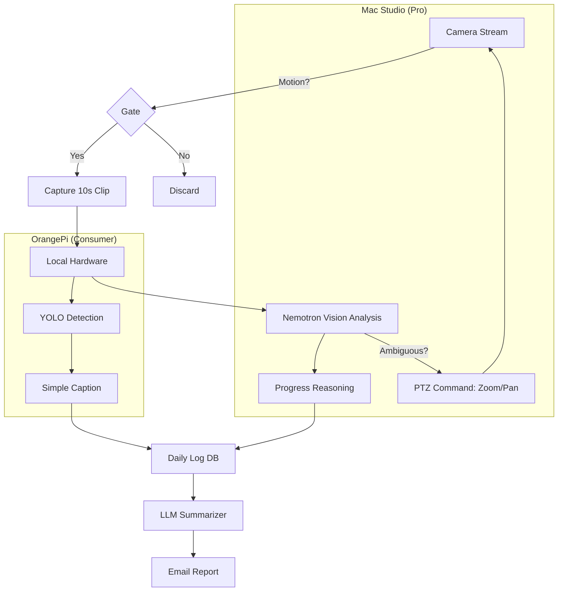

# iHomeNerd Smart Monitoring: "The AI Guard Dog"

**Product Tier:** iScamHunter Hardware
**Hardware:** OrangePi 5 Plus (Starter) | Mac Studio (Pro)
**Core Tech:** Nemotron Nano 2 VL / YOLO / LLaVA

---

## 1. The Vision
Transform dumb premise security ("Recording started...") into **Intelligent Summarization** ("FedEx delivered package at 2:30 PM").

---

## 2. Tier 1: Vacation Mode (Consumer)
**Target Hardware:** `OrangePi 5 Plus` (NPU-driven)
**Use Case:** Homeowners on vacation who want peace of mind without watching 24/7 streams.

### Features
*   **Daily Digest:** A single email at 8:00 PM summarizing all activity.
*   **"Nothing Happened":** The most valuable notification. "Quiet day. No visitors. Lawn sprinklers ran at 6 AM."
*   **Packet Detection:** "UPS left a box at the door." (Using simple object detection).
*   **Privacy First:** All analysis happens on the board. No video is sent to the cloud.

### Tech Stack (Lightweight)
*   **Motion Gate:** Simple pixel-change detection triggers "Wake Up".
*   **Model:** `YOLOv8-Nano` (person, car, dog) + `Nemotron-Nano-2-VL` (captioning 3 key frames).

---

## 3. Tier 2: Construction Mode (Pro)
**Target Hardware:** `Mac Studio` (M1/M2/M3 Max/Ultra)
**Use Case:** Remote property investors monitoring renovation projects.

### Features
*   **Progress Tracking:**
    *   *Monday:* "Drywall sheets delivered to garage."
    *   *Tuesday:* "Crew arrived at 7 AM, left at 3:30 PM. Drywall installed in Living Room."
    *   *Friday:* "Painter is late. No activity detected."
*   **Safety Compliance:** "Worker detected on roof without harness" (Liability protection).
*   **Material Theft Prevention:** "Lumber pile significantly smaller than yesterday, but no construction detected."

### Tech Stack (Heavyweight)
*   **Continuous Stream:** Mac Studio processes 24/7 RTSP streams.
*   **Model:** `Llama-3-V` or `Nemotron-30B` (Int4).
*   **Reasoning:** "Is the wall painted?" requires higher cognitive resolution than "Is there a person?".
*   **Time-Lapse Intelligence:** Compares Daily Deltas to estimate % completion.

### "Active Vision" (PTZ Control)
The Mac Studio doesn't just watch; it **directs**.
1.  **Wide Scan:** Camera stays zoomed out (1x).
2.  **Detection:** "Unidentified object in Sector 4 (Fence Line)."
3.  **Action:** Model calls `ptz_camera.zoom(timestamp, sector=4, zoom=5x)`.
4.  **Re-Analysis:** "Object resolved. It is a fox. Resume wide scan."
5.  **Multi-Cam Tracking:** If object leaves Camera A's view to the left, Agent activates Camera B.

---

## 4. Implementation Strategy

### The "Event Loop"

---
